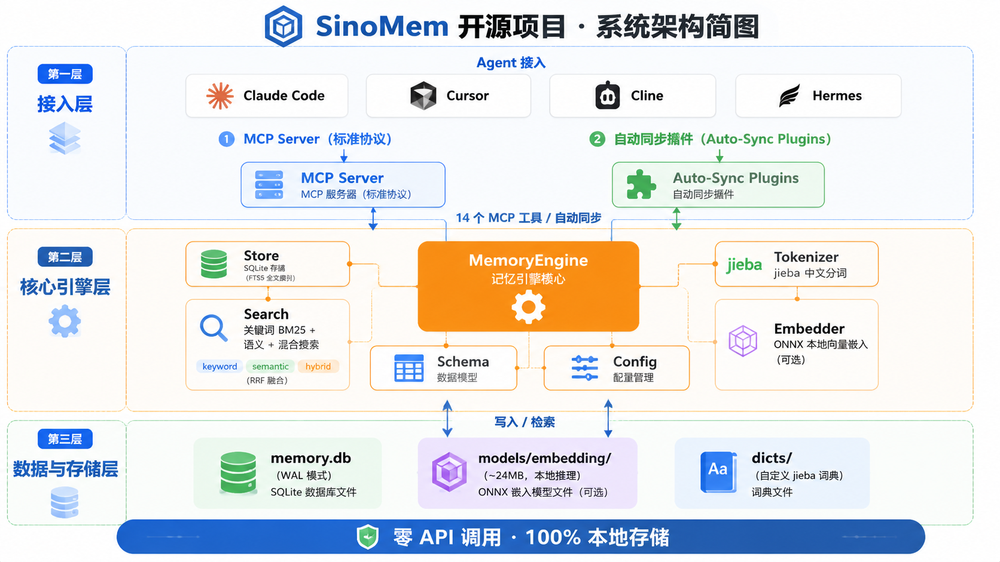

# SinoMem

[English](README_EN.md) | 中文

<p align="center">
  
  
  
  
  
  
  
  
  
  
  
</p>

> 让你的 AI Agent 拥有永不遗忘的长期记忆。
> 一行命令接入，零 API 费用，数据 100% 本地存储。

轻量级中文友好的 Agent 记忆增强系统，支持 SQLite + FTS5 + jieba 分词 + 本地 ONNX 向量搜索，零 API 调用。可通过 MCP 协议接入 Claude Code、Cursor、Cline、Hermes 等任意 Agent。

⭐ 如果 SinoMem 对你有帮助，欢迎点个 Star，让更多开发者看到它！

## 📑 目录

- [效果预览](#-效果预览)
- [快速体验（30 秒上手）](#快速体验30-秒上手)
- [适用场景](#适用场景)
- [为什么选择 SinoMem？](#为什么选择-sinomem)
- [核心特性](#核心特性)
- [项目结构](#项目结构)
- [安装指南](#安装指南)
- [下载嵌入模型（可选，用于语义搜索）](#下载嵌入模型可选用于语义搜索)
- [手动配置 Hermes MCP](#手动配置-hermes-mcp)
- [多 Agent 自动记忆同步（插件系统）](#多-agent-自动记忆同步插件系统)
- [使用方法](#使用方法)
- [搜索模式](#搜索模式)
- [卸载](#卸载)
- [FAQ 常见问题](#faq-常见问题)
- [Roadmap 开发路线](#roadmap-开发路线)
- [贡献指南](#贡献指南)
- [License](#license)
- [联系作者](#联系作者)

---

## 🖼 效果预览

### 系统架构简图



### 演示视频 / GIF（准备中）

> **📌 演示 GIF 放置路径：`assets/demo.gif`（演示 store / search 操作）。**

*（演示素材准备中，欢迎通过 PR 贡献。）*

---

## 快速体验（30 秒上手）

```bash
# 国内用户（Gitee，推荐）
curl -fsSL https://gitee.com/P1M0U/SinoMem/raw/main/install.sh | bash

# 或 GitHub 用户
curl -fsSL https://github.com/P1M0U/SinoMem/raw/main/install.sh | bash -s -- --mirror github

# 安装后打开新终端，即可使用：
sinomem store "用户偏好使用 Docker 部署" -c user_pref
sinomem search "Docker"
# 输出: #1  user_pref  score=0.2
#        用户偏好使用 Docker 部署
```

> 安装到 `~/.local/share/sinomem/`，不会污染 Desktop 目录。安装后可直接使用 `sinomem` 命令。

---

## 适用场景

- 🤖 用 Claude Code / Cursor / Cline / Hermes 等 AI 编程助手的开发者
- 🇨🇳 需要高质量中文分词的记忆场景（jieba 定制分词）
- 🔒 数据不能上云的合规要求（100% 本地 SQLite 存储）
- 💰 不想为 Embedding API 付费的团队（本地 ONNX 推理）
- 🔗 多个 AI 工具之间共享同一份长期记忆

---

## 为什么选择 SinoMem？

| 对比维度 | SinoMem | Mem0 | 内置记忆 |
|---------|-------------------|------|---------|
| 中文分词 | ✅ jieba 定制 | 默认分词 | 默认分词 |
| 本地部署 | ✅ SQLite 单文件 | ❌ 需 API | ✅ 绑定框架 |
| 嵌入模型 | ✅ ONNX 本地 ~24MB | OpenAI API | 无 |
| MCP 协议 | ✅ 标准 MCP Server | ❌ | ❌ |
| 跨 Agent 共享 | ✅ 一份 .db 通用 | ❌ | ❌ |
| 数据库可备份 | ✅ 单文件复制即可 | ❌ | ❌ |
| 费用 | 💰 零 API 费用 | 💰💸 按 token 计费 | 💰 零 |

---

## 核心特性

- **中文 FTS5 搜索** — jieba 分词 + SQLite FTS5，写入和查询用同一套分词器，token 完全对齐
- **语义搜索** — 本地 ONNX 嵌入模型（~24MB 起），可选安装，支持双模自动识别
- **混合搜索** — RRF（倒数排名融合）自动平衡关键词与语义两路结果，无需手动调权
- **MCP Server** — 标准协议，14 个工具，可接入任何支持 MCP 的 Agent
- **多 Agent 自动同步插件** — Claude Code / LangChain / CrewAI / AutoGen / Hermes 开箱即用
- **CLI 工具** — 15 个子命令（store / search / get / update / delete / list / stats / vacuum / clean / reindex / cleanup / migrate / import / store-batch / search-batch）
- **数据迁移** — 支持从 holographic memory 导入，支持为已有记忆补充向量
- **自动去重** — 默认跳过重复内容
- **数据库维护** — VACUUM 回收空间、reindex 重建索引、clean 批量删除
- **内容安全防护** — 自动截断超长内容（8000 字符）
- **线程安全** — check_same_thread=False，支持多 Agent 并发访问

---

## 项目结构

```text
sinomem/        # 核心记忆引擎
├── core/                 # 存储、搜索、分词、嵌入
├── dicts/                # 自定义 jieba 词典
├── entrypoints/          # CLI 和 MCP Server
├── plugins/              # 多 Agent 自动同步插件
│   ├── base.py           # 插件基类（auto_store / auto_search / inject_context）
│   ├── claude_code/      # Claude Code 钩子插件
│   ├── langchain/        # LangChain BaseMemory 组件
│   ├── crewai/           # CrewAI Memory 组件（WIP）
│   ├── autogen/          # AutoGen memory_provider（WIP）
│   └── hermes/           # Hermes MemoryProvider 核心实现
│       └── provider.py   # on_memory_write 自动同步
└── tools/                # 数据迁移与维护工具
hermes_plugin/            # Hermes 插件入口（plugin.yaml + 重导出）
installers/               # Claude Code 自动安装脚本
tests/                    # 测试
models/embedding/         # ONNX 嵌入模型（自动下载）
install.sh                # 一键安装脚本
```

---

## 安装指南

> **💡 本部分是给人类读者的一键安装；** 如果你需要把安装指令交给 AI Agent 自动执行，请使用独立文档 [AGENT_INSTALL.md](AGENT_INSTALL.md)（完整分步指南）。

### 一键脚本（推荐）

```bash
# 国内用户（Gitee）
curl -fsSL https://gitee.com/P1M0U/SinoMem/raw/main/install.sh | bash

# GitHub 用户
curl -fsSL https://github.com/P1M0U/SinoMem/raw/main/install.sh | bash -s -- --mirror github

# 含语义搜索的完整安装
curl -fsSL https://gitee.com/P1M0U/SinoMem/raw/main/install.sh | bash -s -- --with-embedding
```

> 如需手动安装，可克隆仓库后执行 `python3 -m venv .venv && .venv/bin/pip install -e .`。仓库默认安装到 `~/.local/share/sinomem/`。安装脚本自动将 `.venv/bin` 加入 PATH，终端刷新后即可直接使用 `sinomem` 命令。

> **💡 如果你使用的是 Hermes Agent**，推荐通过 **Memory Provider 插件方式**安装，可获得更好的集成体验（自动同步、进程内调用、工具去重）。详见 [Hermes Memory Provider 适配器安装指南](HERMES_ADAPTER.md)。

> **🤖 给智能体的完整安装指引**（分步执行版）见 [AGENT_INSTALL.md](AGENT_INSTALL.md)。

---

## 下载嵌入模型（可选，用于语义搜索）

本项目支持两种嵌入模型，根据你的场景选择其中一个下载即可（系统会自动识别模型类型）：

| 模型 | 大小 | 维度 | 语言 | 适用场景 |
|------|------|------|------|----------|
| **paraphrase-multilingual-MiniLM-L12-v2** | ~113MB | 384 | 50+ 语言 | 多语言混用、中英夹杂内容多 |
| **bge-small-zh-v1.5** | ~24MB | 512 | 中文优化 | 纯中文为主、追求更小体积和更好中文效果 |

```bash
# 创建模型目录
mkdir -p models/embedding/onnx

# 国内用户：设置 HuggingFace 镜像加速（hf-mirror.com 稳定可靠）
export HF_ENDPOINT="https://hf-mirror.com"

# 安装下载工具（国内用户建议使用清华 pip 镜像）
pip install -i https://pypi.tuna.tsinghua.edu.cn/simple huggingface-hub

# ─── 模型 A：paraphrase-multilingual-MiniLM-L12-v2（多语言，~113MB）───
python -c "
from huggingface_hub import hf_hub_download
hf_hub_download('sentence-transformers/paraphrase-multilingual-MiniLM-L12-v2', 'onnx/model_quantized.onnx', local_dir='models/embedding')
hf_hub_download('sentence-transformers/paraphrase-multilingual-MiniLM-L12-v2', 'tokenizer.json', local_dir='models/embedding')
"

# ─── 模型 B：bge-small-zh-v1.5（中文优化，~24MB）───
python -c "
from huggingface_hub import hf_hub_download
hf_hub_download('Xenova/bge-small-zh-v1.5', 'onnx/model_quantized.onnx', local_dir='models/embedding')
hf_hub_download('Xenova/bge-small-zh-v1.5', 'tokenizer.json', local_dir='models/embedding')
"
```

> **💡 镜像说明**：
> - `HF_ENDPOINT=https://hf-mirror.com` — HuggingFace 国内镜像（稳定可靠）
> - pip `-i https://pypi.tuna.tsinghua.edu.cn/simple` — 清华大学 PyPI 镜像
> - 国外用户可省略上述镜像设置，直接使用官方源

不下载模型也能使用，语义搜索会自动降级为关键词搜索。

---

## 手动配置 Hermes MCP

在 `~/.hermes/config.yaml` 的 `mcp_servers:` 下添加：

```yaml
  sinomem:
    args: []
    command: ~/.local/share/sinomem/.venv/bin/python -m sinomem.entrypoints.mcp_server
```

重启 Hermes 后生效。

---

## 多 Agent 自动记忆同步（插件系统）

除了 MCP Server 的主动调用模式，SinoMem 还提供了**自动同步插件**——Agent 无需显式调用记忆工具即可自动管理长期记忆。

### Claude Code（一键安装）

```bash
bash installers/install_claude_code.sh
```

安装后自动启用三条钩子：对话前检索记忆注入 prompt、写入文件时捕获记忆、会话结束时持久化。

### LangChain（一行接入）

```python
from sinomem.plugins.langchain import SinoMemory

agent = create_react_agent(llm, tools, memory=SinoMemory())
```

### CrewAI（一行接入）

```python
from sinomem.plugins.crewai import SinoCrewMemory

crew = Crew(agents=[...], tasks=[...], memory=SinoCrewMemory())
```

### AutoGen（一行接入）

```python
from sinomem.plugins.autogen import SinoAutoGenMemory

assistant = AssistantAgent(name="agent", memory_provider=SinoAutoGenMemory())
```

### 通用 Python API

```python
from sinomem.plugins import create_plugin

plugin = create_plugin()
plugin.auto_store("用户喜欢飞书")
results = plugin.auto_search("协作工具")
```

---

## 使用方法

### CLI 命令行

```bash
# 存储记忆
sinomem store "用户偏好飞书发送文件" -c user_pref -t "飞书"

# 关键词搜索
sinomem search "飞书"

# 语义搜索（需安装 embedding 依赖和模型）
sinomem search "怎么给用户传东西" -m semantic

# 混合搜索（推荐）
sinomem search "MCP协议" -m hybrid

# 获取/更新/删除记忆
sinomem get 1
sinomem update 1 --importance 0.8
sinomem delete 1

# 查看统计
sinomem stats

# 列出所有记忆
sinomem list

# 批量导入（JSON 文件）
sinomem store-batch --file memories.json

# 批量搜索
sinomem search-batch "飞书" "Docker" "Python"

# 清理过期记忆
sinomem cleanup

# 重建 FTS5 索引（词典更新后使用）
sinomem reindex

# 回收已删除的磁盘空间
sinomem vacuum
```

> 💡 `sino` 是 `sinomem` 的简写别名，两者等价。

### MCP Server（Agent 自动调用）

配置完成后，Agent 可以直接调用以下 14 个工具：

| 工具名 | 说明 |
|--------|------|
| `store_memory` | 存储一条记忆（支持去重、TTL 过期、重要性评分） |
| `search_memory` | 搜索记忆（keyword/semantic/hybrid） |
| `get_memory` | 获取指定记忆 |
| `update_memory` | 更新记忆 |
| `delete_memory` | 删除记忆 |
| `delete_memories_by_category` | 按分类批量删除 |
| `list_memories` | 列出记忆（排除过期） |
| `memory_stats` | 查看统计（含过期记忆数） |
| `reindex_memories` | 重建 FTS5 分词索引 |
| `cleanup_memories` | 清理过期记忆 |
| `store_memories_batch` | 批量存储记忆 |
| `search_memories_batch` | 批量搜索多个查询 |
| `vacuum_memory` | 回收已删除记忆占用的磁盘空间 |
| `delete_all_memories` | 清空所有记忆（⚠️ 不可逆操作） |

### 数据迁移

```bash
# 从 holographic memory 导入
sinomem import

# 预览（不实际写入）
sinomem import --dry-run

# 为已有记忆生成向量嵌入
sinomem migrate
```

### 数据库维护

```bash
# 回收已删除记忆占用的磁盘空间
sinomem vacuum
```

大量删除记忆后，SQLite 不会自动回收空间。`vacuum` 命令会重建数据库文件，释放已删除的磁盘空间。

---

## 搜索模式

| 模式 | 说明 | 适用场景 |
|------|------|----------|
| `keyword` | FTS5 关键词匹配 | 精确查找，如搜"飞书" |
| `semantic` | 向量语义相似度 | 模糊查找，如搜"怎么传文件" |
| `hybrid` | 关键词 + 语义加权 | 通用场景，兼顾精确和模糊 |

---

## 卸载

提供一键卸载脚本，可干净移除 SinoMem 及其所有相关配置：

```bash
# 国内用户（Gitee）
curl -fsSL https://gitee.com/P1M0U/SinoMem/raw/main/uninstall.sh | bash

# GitHub 用户
curl -fsSL https://github.com/P1M0U/SinoMem/raw/main/uninstall.sh | bash

# 或本地执行（克隆仓库后）
bash uninstall.sh
```

**卸载内容：**

| 步骤 | 清理项 | 说明 |
|------|--------|------|
| pip 包 | sinomem | 系统 pip + Hermes venv 双重卸载 |
| 安装目录 | `~/.local/share/sinomem/` | 删除全部项目文件 |
| 环境变量 | SINOMEM_HOME / PATH / HF_ENDPOINT | 从 `.bashrc` / `.zshrc` / `.profile` 中移除 |
| Hermes 插件 | `~/.hermes/plugins/sinomem` | 移除符号链接 |
| 记忆数据库 | `~/.sinomem/memory.db` | **交互式询问**，可选择保留或删除 |
| Hermes 依赖 | jieba / tokenizers | 卸载 install.sh 安装到 Hermes venv 的依赖 |
| Claude Code hooks | `settings.local.json` | 检测并提示清理（卸载后残留 hooks 会报错） |
| jieba 缓存 | `~/.cache/jieba` | 询问是否清理 |

> 💡 卸载记忆数据库前会显示记忆条数和文件大小，并需要二次确认。重新安装后可继续使用保留的数据库。

---

## FAQ 常见问题

### Q1：不下载嵌入模型，还能用语义搜索吗？

可以。不下载模型时语义搜索会自动降级为关键词搜索，功能不受影响。需要语义搜索时再下载模型（约 24MB 起）。

### Q2：如何让 Hermes 使用 SinoMem 作为 Memory Provider？

推荐使用 **Hermes Memory Provider 插件方式**安装，详见 [Hermes Memory Provider 适配器安装指南](HERMES_ADAPTER.md)。也可以将 SinoMem 配置为 MCP Server（见[手动配置 Hermes MCP](#手动配置-hermes-mcp)）。

### Q3：多个 Agent 可以共享同一份记忆吗？

可以。SinoMem 使用 SQLite 单文件存储（WAL 模式），支持多 Agent 并发访问（check_same_thread=False），一份 `.db` 文件可在 Claude Code、Cursor、Cline、Hermes 之间共享。

### Q4：如何迁移其他记忆系统的数据？

支持从 holographic memory 导入（`sinomem import`），并为已有记忆补充向量嵌入（`sinomem migrate`）。详见[数据迁移](#数据迁移)。

### Q5：SinoMem 会调用任何云端 API 吗？

不会。数据 100% 本地存储，嵌入推理使用本地 ONNX 模型，零 API 调用、零费用。

---

## Roadmap 开发路线

- [x] SQLite + FTS5 中文全文搜索（jieba 分词）
- [x] 本地 ONNX 语义搜索（可选安装，双模自动识别）
- [x] 混合搜索（RRF 倒数排名融合）
- [x] MCP Server（14 个工具）
- [x] 多 Agent 自动同步插件（Claude Code / LangChain / Hermes）
- [x] 一键安装脚本 + 一键卸载脚本
- [ ] CrewAI / AutoGen 插件完善（当前为 WIP）
- [ ] 录制 CLI 操作演示 GIF（存放至 `assets/demo.gif`）
- [ ] 更多嵌入模型支持
- [ ] 记忆可视化面板

---

## 贡献指南

欢迎参与 SinoMem 的开发！无论是提交 Bug、优化文档还是新增功能，都欢迎你的参与。

- 🐛 发现 Bug → 提交 [Issue](https://gitee.com/P1M0U/SinoMem/issues)
- ✨ 新功能 / 改进 → 提交 [PR](https://gitee.com/P1M0U/SinoMem/pulls)
- 📝 文档优化 / 演示素材 → 直接提交 PR（GIF 等素材建议放入 `assets/`）

适合新手入门的简易任务会打上 **good first issue** 标签，欢迎新手开发者参与。

**开发约定**：请保持模块化设计、代码高内聚低耦合；`.py` 文件提交前执行 `ruff check` 和 `ruff format` 并保证通过；提交信息遵循 Conventional Commits 规范。

---

## License

[Apache 2.0](LICENSE)

Copyright © 2026 [P1M0U](https://github.com/P1M0U) · [Gitee](https://gitee.com/P1M0U)

---

## 联系作者

- 电子邮箱：[p1m0u@foxmail.com](mailto:p1m0u@foxmail.com)
- GitHub：[https://github.com/P1M0U/SinoMem](https://github.com/P1M0U/SinoMem)
- Gitee：[https://gitee.com/P1M0U/SinoMem](https://gitee.com/P1M0U/SinoMem)
